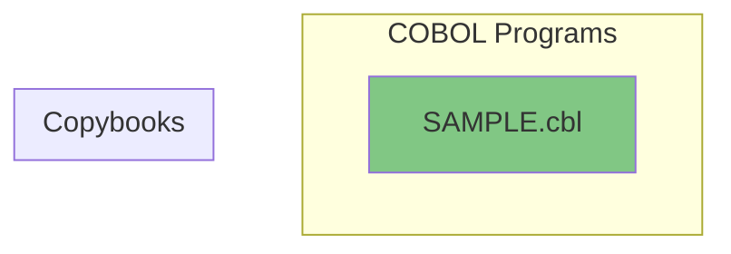

# COBOL Dependency Diagram

```mermaid
graph TB
    subgraph "COBOL Programs"
        P0["SAMPLE.cbl"]
    end
    subgraph "Copybooks"
    end
    classDef programClass fill:#81c784
    classDef copybookClass fill:#ffb74d
    class P0 programClass

```