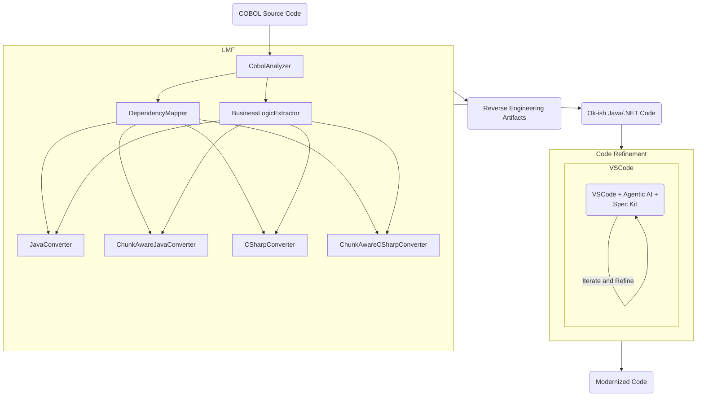

```mermaid
flowchart TD
    COBOL(COBOL Source Code)
    COBOL --> A

    subgraph LMF[LMF]
        A[CobolAnalyzer] --> B[DependencyMapper]
        A --> C[BusinessLogicExtractor]
        B --> D[JavaConverter]
        B --> E[ChunkAwareJavaConverter]
        C --> D
        C --> E
        B --> F[CSharpConverter]
        B --> G[ChunkAwareCSharpConverter]
        C --> F
        C --> G
    end

    style spacer fill:none,stroke:none,color:transparent

   
    LMF --> H(Ok-ish Java/.NET Code)
    H --> PostLMF
    subgraph PostLMF[Code Refinement]
       subgraph VSCode[VSCode]
            I(VSCode + Agentic AI + <br> Spec Kit)
            I -- Iterate and Refine --> I
        end 
    end
    LMF --> K(Reverse Engineering Artifacts)
    PostLMF --> J(Modernized Code)

```
