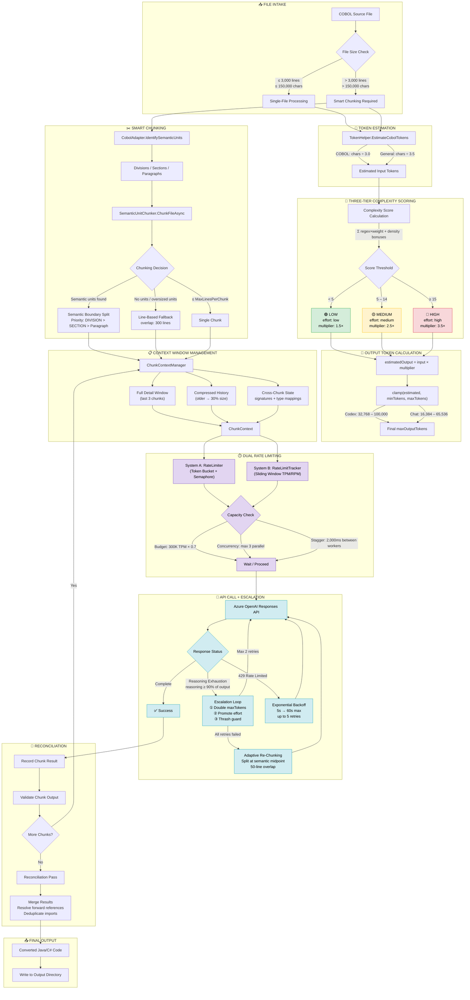

# Smart Chunking & Token Strategy Architecture

> **Last updated**: 2025-02-17  
> This document describes the token management and smart chunking architecture used by the Legacy Modernization Agents to process COBOL source files for migration to Java/C#.

---

## Mermaid Diagram



---

## ASCII Diagram

```
╔══════════════════════════════════════════════════════════════════════════════════════╗
║                        SMART CHUNKING & TOKEN STRATEGY                             ║
║                        Legacy Modernization Agents                                 ║
╚══════════════════════════════════════════════════════════════════════════════════════╝

┌─────────────────────────────────────────────────────────────────────────────────────┐
│  📥 FILE INTAKE                                                                    │
│                                                                                     │
│  COBOL Source File ──► File Size Check                                              │
│                          │                                                          │
│              ┌───────────┴───────────┐                                              │
│              │                       │                                              │
│           ≤ 3,000 lines           > 3,000 lines                                     │
│           ≤ 150,000 chars         > 150,000 chars                                   │
│              │                       │                                              │
│         Single-File             Smart Chunking                                      │
│         Processing              Required ──────────────────────────────────┐        │
│              │                                                             │        │
└──────────────┼─────────────────────────────────────────────────────────────┼────────┘
               │                                                             │
               ▼                                                             ▼
┌─────────────────────────────────────┐    ┌──────────────────────────────────────────┐
│  🔢 TOKEN ESTIMATION               │    │  ✂️  SMART CHUNKING                       │
│                                     │    │                                          │
│  TokenHelper.EstimateCobolTokens    │    │  CobolAdapter                            │
│  ┌─────────────────────────────┐    │    │    ├── IdentifySemanticUnits             │
│  │ COBOL:   chars ÷ 3.0       │    │    │    ├── ExtractVariables                  │
│  │ General: chars ÷ 3.5       │    │    │    ├── ExtractCallDependencies           │
│  │ Safety:  0.5 (truncation)  │    │    │    └── ExtractExternalReferences         │
│  └─────────────────────────────┘    │    │                │                         │
│              │                      │    │                ▼                         │
│    Estimated Input Tokens           │    │  SemanticUnitChunker.ChunkFileAsync      │
│              │                      │    │         │                                │
└──────────────┼──────────────────────┘    │    ┌────┴────┬────────────┐              │
               │                           │    │         │            │              │
               ▼                           │  ≤ Max    Semantic     No units/         │
┌─────────────────────────────────────┐    │  Lines    Units OK     Oversized         │
│  🎯 THREE-TIER COMPLEXITY SCORING   │    │    │         │            │              │
│                                     │    │  Single   Semantic    Line-Based         │
│  Score = Σ(regex × weight)          │    │  Chunk    Boundary    Fallback           │
│        + PIC density bonus (+3)     │    │    │      Split         │               │
│        + Level density bonus (+2)   │    │    │         │       overlap:            │
│        + COPY near WS/LINKAGE (+3)  │    │    │         │       300 lines           │
│        + EXEC SQL/DLI bonus (+4)    │    │    │         │            │              │
│                                     │    │    └────┬────┘            │              │
│  ┌──────────────────────────────┐   │    │         │                 │              │
│  │ Weighted Indicators:        │   │    │         ▼                 │              │
│  │  EXEC SQL ......... wt 3    │   │    │  ┌─────────────────┐     │              │
│  │  EXEC CICS ........ wt 4    │   │    │  │ Split Priority: │     │              │
│  │  EXEC DLI ......... wt 4    │   │    │  │ 1. DIVISION     │     │              │
│  │  PERFORM VARYING .. wt 2    │   │    │  │ 2. SECTION      │     │              │
│  │  EVALUATE TRUE .... wt 2    │   │    │  │ 3. Paragraph    │     │              │
│  │  SEARCH ALL ....... wt 2    │   │    │  │ 4. Any unit     │     │              │
│  │  REDEFINES ........ wt 2    │   │    │  └─────────────────┘     │              │
│  │  OCCURS DEPENDING . wt 3    │   │    │         │                 │              │
│  │  UNSTRING ......... wt 2    │   │    └─────────┼─────────────────┼──────────────┘
│  │  ALTER ............ wt 3    │   │              │                 │
│  │  GO TO DEPENDING .. wt 3    │   │              ▼                 ▼
│  │  CALL ............. wt 2    │   │  ┌──────────────────────────────────────────────┐
│  └──────────────────────────────┘   │  │  📋 CONTEXT WINDOW MANAGEMENT               │
│                                     │  │                                              │
│     Score ──► Tier Assignment       │  │  ChunkContextManager (SQLite-backed)         │
│      │                              │  │                                              │
│  ┌───┴──────┬──────────┐            │  │  ┌──────────────────────────────────────┐    │
│  │          │          │            │  │  │ Full Detail Window (last 3 chunks)   │    │
│  ▼          ▼          ▼            │  │  │  → Complete semantic unit listing    │    │
│ ┌────┐  ┌──────┐  ┌──────┐         │  │  ├──────────────────────────────────────┤    │
│ │LOW │  │MEDIUM│  │ HIGH │         │  │  │ Compressed History (older chunks)    │    │
│ │< 5 │  │ 5-14 │  │ ≥ 15 │         │  │  │  → 30% compression ratio            │    │
│ │1.5×│  │ 2.5× │  │ 3.5× │         │  │  │  → 1-line summary per chunk         │    │
│ │low │  │medium│  │ high │         │  │  ├──────────────────────────────────────┤    │
│ └──┬─┘  └──┬───┘  └──┬───┘         │  │  │ Cross-Chunk State                   │    │
│    │        │         │             │  │  │  → Method signatures (legacy→target) │    │
│    └────────┼─────────┘             │  │  │  → Type mappings (COBOL→Java/C#)    │    │
│             │                       │  │  │  → Forward reference tracking        │    │
└─────────────┼───────────────────────┘  │  └──────────────────────────────────────┘    │
              │                          │              │                                │
              ▼                          │              │  Output: ChunkContext           │
┌─────────────────────────────────────┐  └──────────────┼────────────────────────────────┘
│  📐 OUTPUT TOKEN CALCULATION        │                 │
│                                     │                 │
│  estimated = inputTokens × mult     │                 │
│                                     │                 │
│  ┌──────────────────────────────┐   │                 │
│  │ Codex Profile:              │   │                 │
│  │   min: 32,768  max: 100,000 │   │                 │
│  │   timeout: 900s (15 min)    │   │                 │
│  ├──────────────────────────────┤   │                 │
│  │ Chat Profile:               │   │                 │
│  │   min: 16,384  max: 65,536  │   │                 │
│  │   timeout: 600s (10 min)    │   │                 │
│  └──────────────────────────────┘   │                 │
│                                     │                 │
│  Floor Gate:                        │                 │
│    IF score ≥ 5 OR input ≥ min/2:   │                 │
│      enforce MinOutputTokens floor  │                 │
│    ELSE:                            │                 │
│      floor = max(4096, estimated)   │                 │
│                                     │                 │
│  Final = clamp(est, floor, max)     │                 │
│              │                      │                 │
└──────────────┼──────────────────────┘                 │
               │                                        │
               ▼                                        ▼
┌─────────────────────────────────────────────────────────────────────────────────────┐
│  ⏱️  DUAL RATE LIMITING                                                            │
│                                                                                     │
│  ┌─────────────────────────────────┐  ┌─────────────────────────────────────────┐   │
│  │ System A: RateLimiter           │  │ System B: RateLimitTracker              │   │
│  │ (Token Bucket + Semaphore)      │  │ (Sliding Window TPM/RPM)               │   │
│  │                                 │  │                                         │   │
│  │ Budget: 300K TPM × 0.7 = 210K  │  │ Budget: 500K TPM × 0.9 = 450K          │   │
│  │ Concurrency: max 3 parallel    │  │ RPM: 1,000 × 0.9 = 900                 │   │
│  │ Per-worker delay: ≥ 1,000ms    │  │ Window: 60-second sliding               │   │
│  │ Minute-boundary reset          │  │ Queue-based entry pruning               │   │
│  │                                 │  │                                         │   │
│  │ Flow:                           │  │ Flow:                                   │   │
│  │  1. Acquire semaphore           │  │  1. Prune entries > 60s old             │   │
│  │  2. Lock token bucket           │  │  2. Check: current + est > TPM?         │   │
│  │  3. Check minute counter        │  │  3. Check: requests + 1 > RPM?          │   │
│  │  4. Check last-request delay    │  │  4. Wait for oldest entry to expire     │   │
│  │  5. Check budget allows tokens  │  │  5. RecordUsage(actualTokens) after     │   │
│  │  6. Wait or proceed             │  │                                         │   │
│  └─────────────────────────────────┘  └─────────────────────────────────────────┘   │
│                                                                                     │
│  Speed Profiles:                                                                    │
│  ┌──────────┬───────────┬────────────┬─────────────┬────────────┬───────────┐       │
│  │ Profile  │ Reasoning │ MaxOutput  │ Par.Workers │ Stagger    │ Safety    │       │
│  ├──────────┼───────────┼────────────┼─────────────┼────────────┼───────────┤       │
│  │ TURBO    │ low (all) │ 65,536     │ 4           │ 200ms      │ 0.85      │       │
│  │ FAST     │ low/med   │ 32,768     │ 3           │ 500ms      │ —         │       │
│  │ BALANCED │ adaptive  │ 100,000    │ 2           │ 1,000ms    │ 0.70      │       │
│  │ THOROUGH │ med/high  │ 100,000    │ 2           │ 1,500ms    │ —         │       │
│  └──────────┴───────────┴────────────┴─────────────┴────────────┴───────────┘       │
│              │                                                                      │
└──────────────┼──────────────────────────────────────────────────────────────────────┘
               │
               ▼
┌─────────────────────────────────────────────────────────────────────────────────────┐
│  🤖 API CALL + ESCALATION                                                          │
│                                                                                     │
│  ┌──────────────────────────────────────────────────────────────┐                   │
│  │                Azure OpenAI Responses API                    │                   │
│  │                (gpt-5.1-codex-mini)                          │                   │
│  └──────────────────────────┬───────────────────────────────────┘                   │
│                             │                                                       │
│                    ┌────────┴────────┬──────────────────┐                           │
│                    │                 │                  │                            │
│                    ▼                 ▼                  ▼                            │
│               ✅ Complete    Reasoning Exhaustion   429 Rate Limited                │
│                    │         (reason ≥ 90% output)      │                           │
│                    │              │                      │                           │
│                    │              ▼                      ▼                           │
│                    │     ┌─────────────────┐    ┌─────────────────┐                 │
│                    │     │ Escalation Loop │    │ Exp. Backoff    │                 │
│                    │     │                 │    │ 5s → 60s max    │                 │
│                    │     │ ① 2× tokens    │    │ up to 5 retries │                 │
│                    │     │ ② ↑ effort     │    └────────┬────────┘                 │
│                    │     │    low→med→high │             │                           │
│                    │     │ ③ thrash guard  │             │                           │
│                    │     │ max 2 retries   │        ┌────┘                          │
│                    │     └───────┬─────────┘        │                               │
│                    │             │                   │                               │
│                    │        ┌────┴────┐              │                               │
│                    │     Success?  All failed        │                               │
│                    │        │         │              │                               │
│                    │        │         ▼              │                               │
│                    │        │  ┌──────────────┐      │                               │
│                    │        │  │ Adaptive     │      │                               │
│                    │        │  │ Re-Chunking  │      │                               │
│                    │        │  │              │      │                               │
│                    │        │  │ Split at     │      │                               │
│                    │        │  │ semantic     │      │                               │
│                    │        │  │ midpoint     │      │                               │
│                    │        │  │ 50-line      │      │                               │
│                    │        │  │ overlap      │      │                               │
│                    │        │  └──────┬───────┘      │                               │
│                    │        │         │              │                               │
│                    ◄────────┴─────────┴──────────────┘                              │
│                    │                                                                 │
└────────────────────┼────────────────────────────────────────────────────────────────┘
                     │
                     ▼
┌─────────────────────────────────────────────────────────────────────────────────────┐
│  🔗 RECONCILIATION & OUTPUT                                                        │
│                                                                                     │
│  ┌────────────────────────────────────────────────────────────────┐                 │
│  │ Per-Chunk Pipeline:                                           │                 │
│  │   Record Result → Validate Chunk → Store in SQLite            │                 │
│  │     └─ signatures, type_mappings, forward_references          │                 │
│  └────────────────────────────────────────────────────────────────┘                 │
│                             │                                                       │
│                    More chunks? ──Yes──► Back to Context Management                 │
│                             │                                                       │
│                            No                                                       │
│                             │                                                       │
│                             ▼                                                       │
│  ┌────────────────────────────────────────────────────────────────┐                 │
│  │ Reconciliation Pass:                                          │                 │
│  │   ├── Merge all chunk outputs                                 │                 │
│  │   ├── Resolve forward references                              │                 │
│  │   ├── Deduplicate imports/package declarations                │                 │
│  │   └── Final validation                                        │                 │
│  └────────────────────────────────────────────────────────────────┘                 │
│                             │                                                       │
│                             ▼                                                       │
│  ┌────────────────────────────────────────────────────────────────┐                 │
│  │ 📤 FINAL OUTPUT                                               │                 │
│  │   Converted Java/C# Code → output/ directory                  │                 │
│  └────────────────────────────────────────────────────────────────┘                 │
│                                                                                     │
└─────────────────────────────────────────────────────────────────────────────────────┘
```

---

## Key Constants Reference

| Constant | Value | Source |
|---|---|---|
| COBOL chars/token | 3.0 | `TokenHelper.cs` |
| General chars/token | 3.5 | `TokenHelper.cs` |
| Safety margin (truncation) | 0.5 | `TokenHelper.cs` |
| Auto-chunk char threshold | 150,000 | `appsettings.json` |
| Auto-chunk line threshold | 3,000 | `appsettings.json` |
| Max tokens per chunk | 28,000 | `appsettings.json` |
| Max lines per chunk | 1,500 | `appsettings.json` |
| Overlap lines | 300 | `appsettings.json` |
| Min semantic unit size | 50 lines | `appsettings.json` |
| Full detail chunk window | 3 chunks | `appsettings.json` |
| Compression ratio | 0.3 (30%) | `appsettings.json` |
| Max parallel chunks | 6 | `appsettings.json` |
| Parallel stagger delay | 2,000ms | `appsettings.json` |
| Token budget per minute | 300,000 | `appsettings.json` |
| Rate limit safety factor | 0.7 | `appsettings.json` |
| LOW threshold | score < 5 | `appsettings.json` |
| MEDIUM threshold | score ≥ 5 | `appsettings.json` |
| HIGH threshold | score ≥ 15 | `appsettings.json` |
| LOW multiplier | 1.5× | `appsettings.json` |
| MEDIUM multiplier | 2.5× | `appsettings.json` |
| HIGH multiplier | 3.5× | `appsettings.json` |
| Codex min output tokens | 32,768 | `appsettings.json` |
| Codex max output tokens | 100,000 | `appsettings.json` |
| Codex timeout | 900s (15 min) | `appsettings.json` |
| Escalation retries (Codex) | 2 | `appsettings.json` |
| Escalation multiplier (Codex) | 2.0× | `appsettings.json` |
| Re-chunk overlap | 50 lines | `AgentBase.cs` |
| Backoff base delay | 5,000ms | `RateLimiter.cs` |
| Backoff max delay | 60,000ms | `RateLimiter.cs` |
| Max 429 retries | 5 | `RateLimiter.cs` |

---

## Complexity Scoring Indicators

| COBOL Pattern | Weight | Notes |
|---|---|---|
| `EXEC SQL` | 3 | Embedded SQL |
| `EXEC CICS` | 4 | CICS transactions |
| `EXEC DLI` | 4 | IMS/DB2 |
| `PERFORM VARYING` | 2 | Loop with counter |
| `PERFORM UNTIL` | 1 | Conditional loop |
| `EVALUATE TRUE` | 2 | Switch/case equivalent |
| `SEARCH ALL` | 2 | Binary search |
| `REDEFINES` | 2 | Memory overlay |
| `OCCURS n DEPENDING` | 3 | Variable-length arrays |
| `OCCURS n` | 1 | Fixed arrays |
| `COMPUTE` | 1 | Arithmetic expression |
| `INSPECT` | 1 | String inspection |
| `STRING` | 1 | String concatenation |
| `UNSTRING` | 2 | String parsing |
| `CALL 'program'` | 2 | External program call |
| `ALTER` | 3 | Dynamic GO TO (legacy) |
| `GO TO DEPENDING` | 3 | Computed GO TO |
| `COPY` | 1 | Copybook include |
| `REPLACE` | 2 | Text substitution |

**Bonus scores:**
- PIC density > 25%: +3
- Level number density > 30%: +2
- COPY near WORKING-STORAGE/LINKAGE: +3
- EXEC SQL/DLI present: +4
